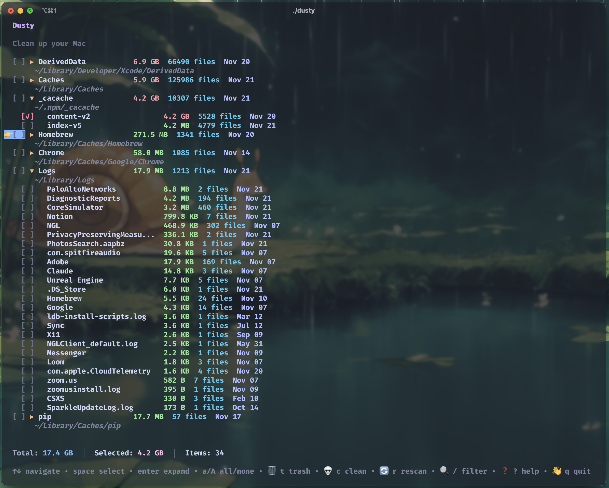

# Dusty 🧹

A CleanMyMac-style TUI for macOS. Clean up caches, logs, and build artifacts safely from your terminal.




## Features

- Scan common cache directories (Xcode, npm, yarn, system caches)
- Interactive TUI with Catppuccin Mocha theme
- Expandable directories to see individual items
- Move to Trash 🗑️ or permanently clean 💀
- Color-coded sizes (green/yellow/red)
- Filter and search

## Installation

### Prerequisites

If you don't have Go installed:

```bash
# Using Homebrew (recommended)
brew install go

# Or download from https://go.dev/dl/
```

### Using Go

```bash
go install github.com/han-nwin/dusty@v0.1.0
```

Make sure `$GOPATH/bin` is in your PATH:

```bash
export PATH=$PATH:$(go env GOPATH)/bin
```

### Build from source

```bash
git clone https://github.com/han-nwin/dusty
cd dusty
go build -o dusty
./dusty
```

## Usage

```bash
dusty
```

### Keyboard Shortcuts

| Key           | Action                      |
| ------------- | --------------------------- |
| `↑↓` / `jk`   | Navigate                    |
| `Space`       | Toggle selection            |
| `Enter` / `l` | Expand/collapse directory   |
| `a`           | Select all                  |
| `A`           | Deselect all                |
| `t`           | 🗑️ Move to Trash            |
| `c`           | 💀 Clean (permanent delete) |
| `r`           | 🔄 Rescan                   |
| `/`           | 🔍 Filter                   |
| `?`           | ❓ Help                     |
| `q`           | 👋 Quit                     |

## What Gets Cleaned

- `~/Library/Caches` - System and app caches
- `~/Library/Logs` - Log files
- `~/Library/Developer/Xcode/DerivedData` - Xcode build artifacts
- `~/Library/Developer/Xcode/Archives` - Xcode archives
- `~/.npm/_cacache` - npm cache
- `~/.cache/yarn` - Yarn cache
- `~/Library/Caches/pip` - Python pip cache
- `~/Library/Caches/Homebrew` - Homebrew cache
- `~/.gradle/caches` - Gradle cache
- `~/.cargo/registry` - Cargo registry
- Chrome and Safari caches

## Safety

- Only scans allowlisted paths
- Never requires sudo
- Confirmation before any deletion
- Clear warnings for permanent deletion
- Trash option keeps files recoverable

## Requirements

- macOS
- Go 1.21+ (for installation)

## License

MIT
